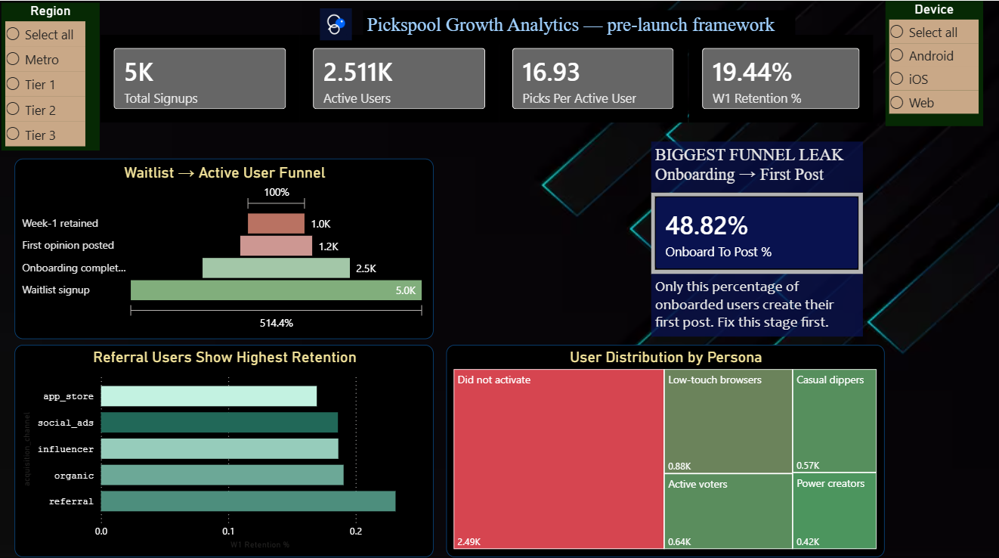
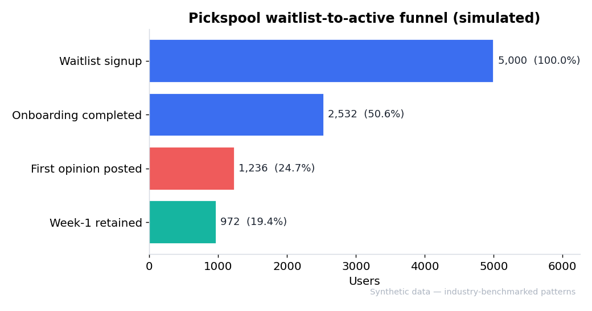
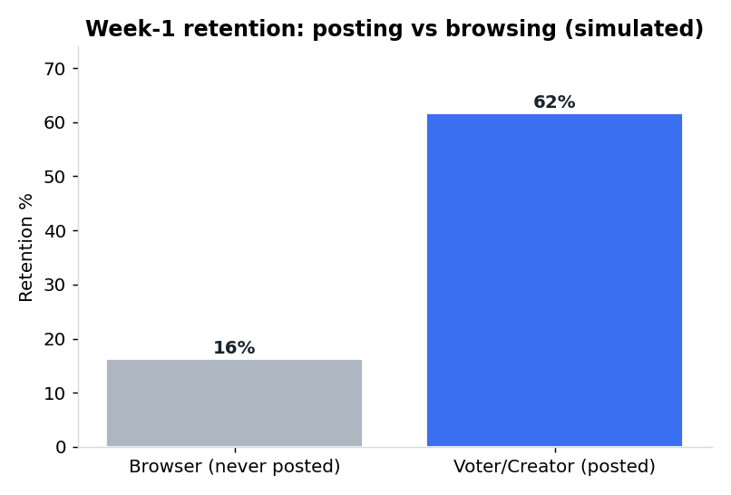
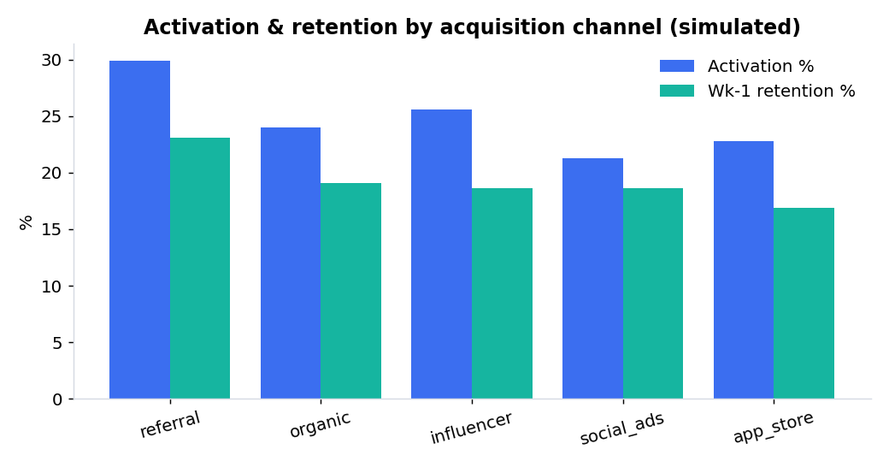
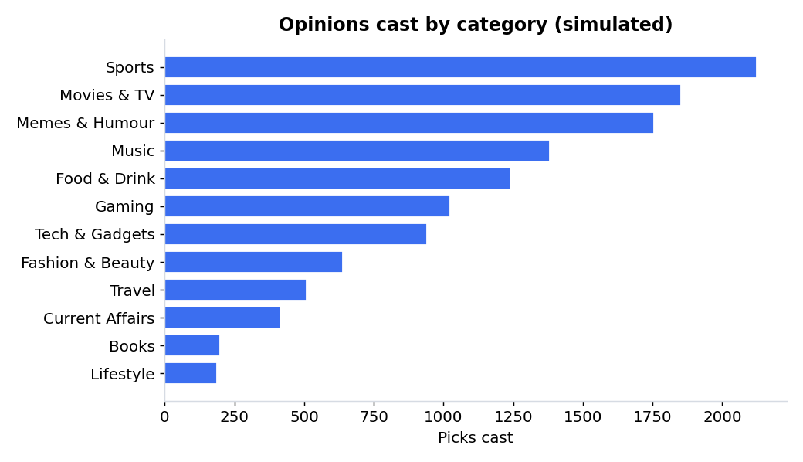
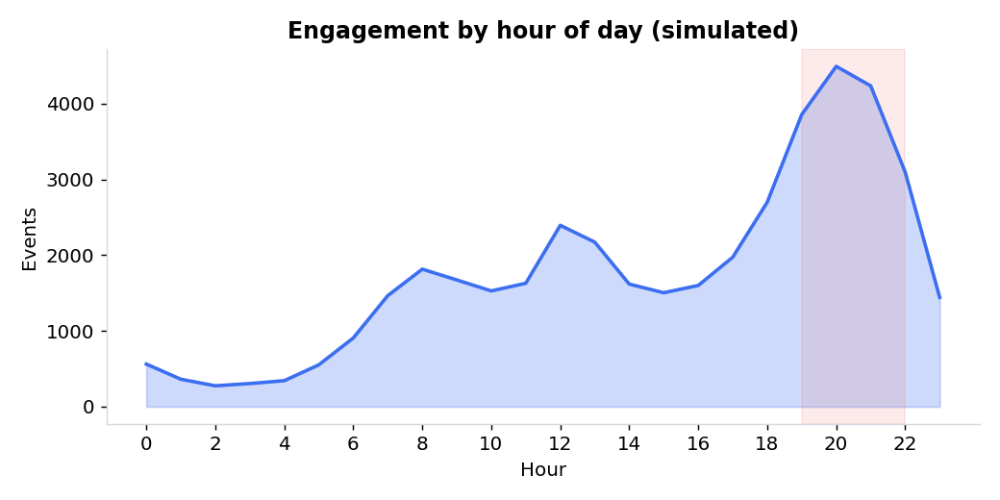
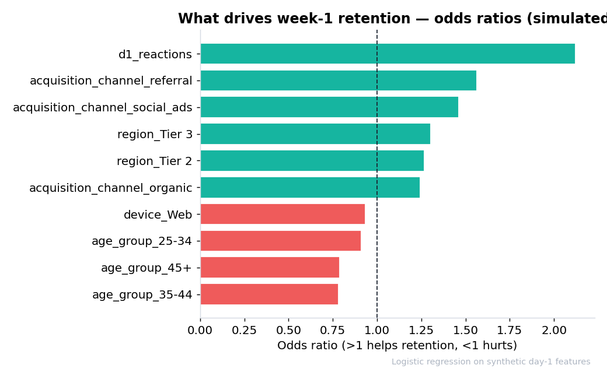
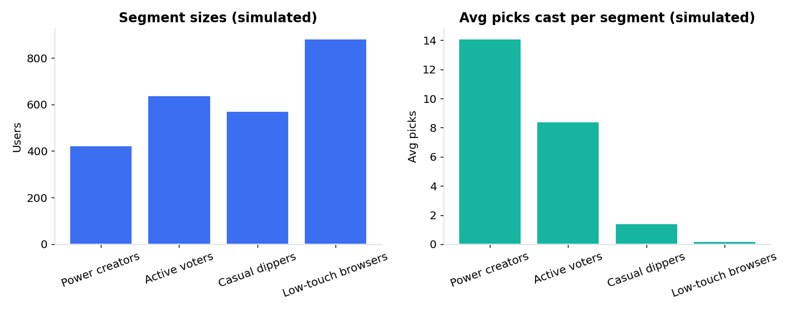
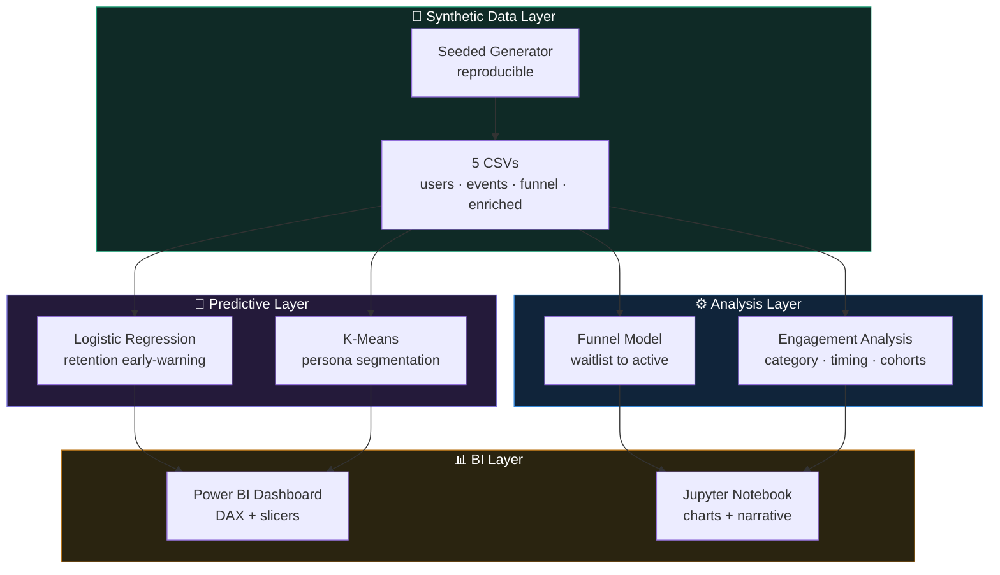

<div align="center">


<br/>

<p>
  
  
  
  
  
</p>

<p>
  
  
  
  
  
</p>

<br/>

> **A pre-launch growth-analytics framework for [Pickspool](https://pickspool.com/)** — an opinion-first social network currently at the waitlist stage. Before the product launches, this project defines *what to measure, where users will leak, and who they'll become* — built on a clearly-labeled synthetic dataset grounded in public consumer-social benchmarks.

</div>

---

> ### ⚠️ Honesty note (please read first)
>
> **This project uses a 100% synthetic, simulated dataset.** Pickspool is pre-launch, so no real usage data exists or is publicly accessible. I did **not** scrape private data, and **none of these numbers are real Pickspool figures.**
>
> What *is* real is the **methodology**: the simulated distributions and funnel drop-offs are modelled on publicly reported patterns for early-stage consumer social apps (waitlist→activation rates, the "first content" drop-off, the creator-vs-browser retention gap, evening engagement peaks). Every chart is labelled **(simulated)**. The goal is to show how I'd think about Pickspool's analytics on day one — not to claim knowledge of its real performance.

---

## 📊 The Dashboard

> Built in Power BI from the enriched dataset. Interactive slicers for region, device, channel, and ML-derived persona. Open `Pickspool Visualization.pbix` to explore it live (Power BI Desktop is free).

<div align="center">



</div>

---

## 📋 Table of Contents

| # | Section | Description |
|---|---------|-------------|
| 1 | [🎯 Why This Project](#-why-this-project) | The pre-launch analytics problem |
| 2 | [💡 Solution Overview](#-solution-overview) | What the framework delivers |
| 3 | [🔎 Headline Insights](#-headline-insights-simulated) | Funnel, channels, timing |
| 4 | [🧠 Predictive Layer](#-predictive-layer-light-interpretable-ml) | Retention model + segmentation |
| 5 | [🏗️ Architecture](#-system-architecture) | How it fits together |
| 6 | [🧩 The Dataset](#-the-dataset-synthetic) | Schema & grounding |
| 7 | [📐 Day-One Metric Framework](#-recommended-day-one-metric-framework) | What to track from launch |
| 8 | [⚙️ Tech Stack](#-tech-stack) | Tools used |
| 9 | [📁 Project Structure](#-project-structure) | Repo layout |
| 10 | [🚀 How to Run](#-how-to-run) | Reproduce everything |
| 11 | [🧑‍💻 Author](#-author) | About me |

---

## 🎯 Why This Project

Pickspool is an opinion-first social network where users **create a Pick, vote & react, and see what's trending** — currently at the waitlist stage with [10,000+ early-access signups](https://pickspool.com/). The single most valuable thing an analyst can do *before* launch is define **what to measure and which leaks to watch**, so the team isn't flying blind on launch day.

<details open>
<summary><b>📉 The pre-launch blind spot</b></summary>

<br/>

> Most early teams launch without an instrumentation plan, then scramble to define metrics *after* the data starts flowing — losing weeks of signal. This framework front-loads that work: a complete funnel, engagement model, retention model, and segmentation, ready to point at real data on day one.

</details>

<details>
<summary><b>🕳️ Where consumer-social products actually leak</b></summary>

<br/>

> Across comparable apps, the largest funnel drop is almost never at signup — it's at the **first content action** (getting a user to post once). This project quantifies that leak for Pickspool's waitlist→active journey so the team knows exactly where to intervene.

</details>

<details>
<summary><b>👥 Not all users are equal</b></summary>

<br/>

> Posters retain several times better than passive browsers. A framework that treats "signed up" as success will optimize the wrong thing. This one defines activation as **first opinion posted**, and segments users into actionable personas.

</details>

---

## 💡 Solution Overview

```
┌──────────────────────────────────────────────────────────────────┐
│                   PICKSPOOL GROWTH ANALYTICS                      │
│            Pre-Launch Framework on Synthetic Data                 │
├──────────────────┬────────────────────┬──────────────────────────┤
│  5,000 simulated │  42K+ engagement   │  Waitlist → Active        │
│  waitlist users  │  events            │  funnel model             │
├──────────────────┼────────────────────┼──────────────────────────┤
│  Logistic        │  K-Means user      │  Interactive Power BI     │
│  retention model │  segmentation      │  dashboard                │
└──────────────────┴────────────────────┴──────────────────────────┘
        ↓                    ↓                       ↓
  Find the funnel      Predict who will        Show the team what
  leak before launch   churn, group users      to track from day one
```

| Problem (pre-launch) | This framework's answer | Output |
|---|---|---|
| No metrics defined | Full day-one metric framework | Dashboard + DAX |
| Unknown funnel leaks | Waitlist→active funnel model | Funnel visual |
| Can't predict churn | Logistic retention early-warning | Per-user score |
| Users undifferentiated | K-Means persona segmentation | Persona labels |
| Engagement unknown | Category + timing analysis | Engagement views |

---

## 🔎 Headline Insights (simulated)

> Illustrative outputs of the framework on the synthetic data — they demonstrate the *analysis*, not real Pickspool results.

### 1️⃣ The funnel: 19.4% of signups reach week-1 retention

<div align="center">



</div>

| Stage | Users | % of waitlist |
|---|---|---|
| Waitlist signup | 5,000 | 100% |
| Onboarding completed | 2,532 | 50.6% |
| First opinion posted | 1,236 | 24.7% |
| Week-1 retained | 972 | 19.4% |

**The biggest single leak is Onboarding → First post — only 48.8% of onboarded users post once.**
→ *The #1 launch lever is getting onboarded users to cast their first Pick. A guided "create your first Pick" onboarding step targets exactly this.*

### 2️⃣ Posting users retain 3.8× better than browsers

<div align="center">



</div>

Week-1 retention is **61.7%** for users who posted vs **16.2%** for browsers.
→ *Activation should be defined as "first opinion posted," not "signed up."*

### 3️⃣ Referral is the strongest channel; paid social the weakest

<div align="center">



</div>

→ *Prioritise referral loops over paid spend pre-launch.*

### 4️⃣ Sports, Movies & TV, and Memes drive the most opinions

<div align="center">



</div>

→ *Seed launch content in these categories — they match the travel / sneakers / phone picks already shown on Pickspool's site.*

### 5️⃣ Engagement peaks in the evening (20:00–21:00)

<div align="center">



</div>

The 19:00–22:00 window carries ~37% of all activity.
→ *Schedule daily prompts and notifications for early evening.*

---

## 🧠 Predictive Layer (light, interpretable ML)

Two interpretable models — deliberately chosen over heavy ML to fit a **data-analyst** brief. Both exclude the hidden generator field (`engagement_propensity`) to avoid leakage; they learn only from observable signup + early-activity signals.

### Model 1 — Retention early-warning (Logistic Regression)

<div align="center">



</div>

- Test **ROC-AUC ≈ 0.66** — a modest but real lift, reported honestly (a believable 0.66 beats a suspicious 0.95).
- Standout driver: **earning reactions on day 1 makes a user ~2.1× more likely to be retained.**
- Output: a `predicted_retention_prob` for every onboarded user → flag low scores for a day-2 nudge.

### Model 2 — Behavioural segmentation (K-Means, k = 4)

<div align="center">



</div>

| Persona | Users | Avg picks | Read |
|---|---|---|---|
| Power creators | 422 | 14.1 | small but carry the platform |
| Active voters | 637 | 8.4 | the engaged core |
| Casual dippers | 570 | 1.4 | light, winnable with nudges |
| Low-touch browsers | 882 | 0.2 | largest group, mostly passive |

> *Note on k:* silhouette technically peaks at k=2 (which just splits active vs inactive). I chose **k=4** for business-useful personas — a deliberate trade of a little statistical separation for interpretability. The persona label feeds the dashboard as a slicer.

---

## 🏗️ System Architecture



---

## 🧩 The Dataset (synthetic)

Generated with a fixed seed (fully reproducible). Star schema, Power BI–ready.

| File | Grain | Rows |
|---|---|---|
| `pickspool_users.csv` | one row per waitlist signup | 5,000 |
| `pickspool_users_enriched.csv` | users + ML outputs (persona, retention score) | 5,000 |
| `pickspool_events.csv` | one row per engagement action | **42,523** |
| `pickspool_funnel_stages.csv` | pre-aggregated funnel | 4 |
| `data_dictionary.csv` | column definitions | — |

**Key columns**

| Table | Column | Description |
|---|---|---|
| users | `acquisition_channel` | referral / organic / influencer / app_store / social_ads |
| users | `onboarding_completed`, `first_opinion_posted`, `active_week_1` | funnel stage flags |
| enriched | `predicted_retention_prob` | logistic-model retention score |
| enriched | `cluster_label` | K-Means persona |
| events | `category` | opinion category (Sports, Movies & TV, Memes, …) |
| events | `action_type` | pick / browse / react / comment / share |
| events | `event_hour`, `day_of_week` | posting-time analysis |
| events | `reactions_received` | engagement proxy |

**Grounding:** ranges reflect public consumer-social patterns — referral/influencer channels convert best, the first-post step leaks most, posters retain several-fold better than browsers, and engagement peaks 20:00–22:00. The 5,000-user sample is sized as a representative slice of Pickspool's stated 10,000+ waitlist.

---

## 📐 Recommended Day-One Metric Framework

| Layer | Metric | Why it matters |
|---|---|---|
| Acquisition | Signups by channel | Where users come from |
| **Activation** | **% posting first Pick** | The real leading indicator |
| Engagement | Picks/user, category mix, posting-hour heatmap | What keeps users casting |
| Retention | Week-1 / Week-4, voter vs browser cohorts | The growth flywheel |
| Funnel health | Stage-to-stage conversion | Where to intervene |

---

## ⚙️ Tech Stack

| Layer | Technology | Purpose |
|---|---|---|
| Data generation | Python, NumPy, Pandas | Seeded synthetic dataset |
| Analysis | Pandas, Matplotlib | Funnel, engagement, cohorts |
| Machine learning | scikit-learn | Logistic regression + K-Means |
| BI dashboard | Microsoft Power BI (DAX) | Interactive dashboard |
| Notebook | Jupyter | Narrated analysis + charts |

---

## 📁 Project Structure

```
Pickspool-Growth-Analytics/
│
├── 📓 pickspool_analysis.ipynb     # Full narrated analysis: data gen → insights → ML
├── 📊 Pickspool Visualization.pbix # Interactive Power BI dashboard
├── 🖼️ Pickspool_Visualization.png  # Dashboard preview
├── 📄 dax_measures.txt             # Copy-paste DAX measures
├── 📄 requirements.txt             # Dependencies
│
├── 📁 data/                        # Synthetic CSVs + data dictionary
│   ├── pickspool_users.csv
│   ├── pickspool_users_enriched.csv
│   ├── pickspool_events.csv
│   ├── pickspool_funnel_stages.csv
│   └── data_dictionary.csv
│
└── 📁 charts/                      # Reference charts (01–08)
```

---

## 🚀 How to Run

### Option 1 — Notebook (recommended)
```bash
# 1. Clone
git clone https://github.com/debasmita30/Pickspool-Growth-Analytics.git
cd Pickspool-Growth-Analytics

# 2. Install dependencies
pip install -r requirements.txt

# 3. Open and run all cells
jupyter notebook pickspool_analysis.ipynb
```
The notebook regenerates the synthetic data, runs the funnel + engagement analysis, trains both models, and saves the charts. Because it's seeded, anyone who runs it gets the **identical** dataset — the data is fully reproducible from the code.

### Option 2 — Google Colab (no install)
Upload `pickspool_analysis.ipynb` to [Colab](https://colab.research.google.com), run all cells, done.

### View the dashboard
Open `Pickspool Visualization.pbix` in **Power BI Desktop** (free) to interact with the live dashboard, or see `Pickspool_Visualization.png` for a preview.

---

## 🧑‍💻 Author

<div align="center">


<br/><br/>

### Debasmita Chatterjee

*B.Tech CSE + Minor in Data Science · Lovely Professional University, Punjab, India*

**Data Analysis · Power BI · SQL · Python · Machine Learning**

<p>
  <a href="https://www.linkedin.com/in/debasmita-chatterjee/">
    
  </a>
  &nbsp;
  <a href="https://github.com/debasmita30">
    
  </a>
  &nbsp;
  <a href="https://ml-engineer-portfolio-f2df.vercel.app/">
    
  </a>
</p>

<br/>

> *"Before Pickspool launches, here's the analytics framework I'd recommend tracking from day one."*

</div>

---

<div align="center">

### ⭐ Built as a tailored analytics framework for Pickspool — honest synthetic data, real methodology.


</div>
